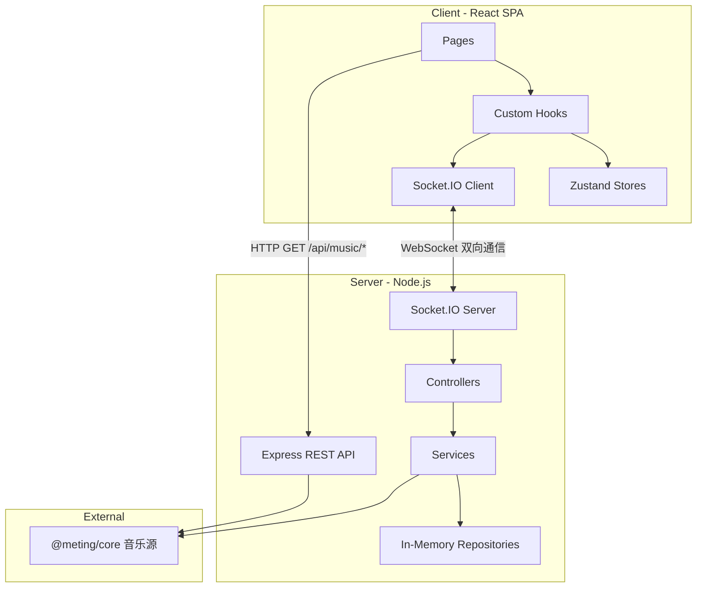

# 架构与数据流

## 整体架构



## Socket 事件清单

| 分类         | 客户端 → 服务端                                                                                                                     | 服务端 → 客户端                                                                                                                            |
| ------------ | ----------------------------------------------------------------------------------------------------------------------------------- | ------------------------------------------------------------------------------------------------------------------------------------------ |
| **Room**     | `room:create`, `room:join`, `room:leave`, `room:list`, `room:settings`, `room:set_role`                                             | `room:created`, `room:state`, `room:user_joined`, `room:user_left`, `room:settings`, `room:error`, `room:list_update`, `room:role_changed` |
| **Player**   | `player:play`, `player:pause`, `player:seek`, `player:next`, `player:prev`, `player:sync`, `player:sync_request`, `player:set_mode` | `player:play`, `player:pause`, `player:resume`, `player:seek`, `player:sync_response`                                                      |
| **Queue**    | `queue:add`, `queue:add_batch`, `queue:remove`, `queue:reorder`, `queue:clear`                                                      | `queue:updated`                                                                                                                            |
| **Chat**     | `chat:message`                                                                                                                      | `chat:message`, `chat:history`                                                                                                             |
| **Vote**     | `vote:start`, `vote:cast`                                                                                                           | `vote:started`, `vote:result`                                                                                                              |
| **Auth**     | `auth:request_qr`, `auth:check_qr`, `auth:set_cookie`, `auth:logout`, `auth:get_status`                                             | `auth:qr_generated`, `auth:qr_status`, `auth:set_cookie_result`, `auth:status_update`, `auth:my_status`                                    |
| **Playlist** | `playlist:get_my`                                                                                                                   | `playlist:my_list`                                                                                                                         |
| **NTP**      | `ntp:ping`                                                                                                                          | `ntp:pong`                                                                                                                                 |

## 关键数据模型

```typescript
// 音乐曲目
interface Track {
  id: string
  title: string
  artist: string[]
  album: string
  duration: number
  cover: string
  source: 'netease' | 'tencent' | 'kugou'
  sourceId: string
  urlId: string
  lyricId?: string
  picId?: string
  streamUrl?: string
  requestedBy?: string // 点歌人昵称
  vip?: boolean // 是否为 VIP / 付费歌曲（可能无法播放或仅试听）
}

// 播放模式
type PlayMode = 'sequential' | 'loop-all' | 'loop-one' | 'shuffle'

// 音频质量档位 (kbps)
type AudioQuality = 128 | 192 | 320 | 999

// 客户端可见的房间状态
interface RoomState {
  id: string
  name: string
  creatorId: string
  hostId: string
  hasPassword: boolean
  password?: string | null // 仅 owner 专用状态携带；公开状态不含该字段
  audioQuality: AudioQuality
  users: User[]
  queue: Track[]
  currentTrack: Track | null
  playState: PlayState
  playMode: PlayMode
}

// 播放状态（含服务端时间戳用于同步校准）
interface PlayState {
  isPlaying: boolean
  currentTime: number
  serverTimestamp: number
}

// 预定执行播放状态（play/pause/seek/resume 广播时使用）
interface ScheduledPlayState extends PlayState {
  serverTimeToExecute: number // 客户端应在此服务器时间点执行动作
}

// 歌单元数据
interface Playlist {
  id: string
  name: string
  cover: string
  trackCount: number
  source: MusicSource
  creator?: string
  description?: string
}

// 用户（RBAC: owner > admin > member）
// hostId 是自动选举的播放主持(conductor)，不是可见角色
interface User {
  id: string
  nickname: string
  role: UserRole
}
type UserRole = 'owner' | 'admin' | 'member'

// 聊天消息
interface ChatMessage {
  id: string
  userId: string
  nickname: string
  content: string
  timestamp: number
  type: 'user' | 'system'
}
```

## 播放同步机制

采用**事件驱动同步 + 周期性比例漂移校正**架构：NTP 时钟同步 + Scheduled Execution + 比例控制漂移校正（EMA 平滑 + proportional rate + hard seek）。

**三层防护**：

1. **NTP 时钟同步**：保证各客户端时钟与服务器对齐（时间衰减加权中位数）
2. **Scheduled Execution**：离散事件（play/pause/seek/resume）通过预定执行消除网络延迟差异（P90 RTT 自适应调度）
3. **周期性比例漂移校正**：客户端每 2 秒发起 `PLAYER_SYNC_REQUEST`，服务端返回当前预期位置；漂移经 EMA 低通滤波后进入比例控制器。30–500ms 使用连续 rate 微调收敛，避免误差积累；超过 500ms 且持续确认后才使用可能刷新移动端解码缓冲的 hard seek

## Layer 1：NTP 时钟同步 + RTT 回报

客户端与服务器通过 `ntp:ping` / `ntp:pong` 事件交换时间戳，计算 `clockOffset`（客户端与服务端时钟差值），使 `getServerTime()` 返回与服务端对齐的时间。

- 初始阶段：快速采样（每 50ms）收集 20 个样本，使用 `switchedRef` 保证仅在首次校准完成时切换到稳定阶段
- 稳定阶段：每 5 秒一次 NTP 心跳
- NTP 仅在用户进入房间后启动（`ClockSyncRunner` 渲染在 `RoomPage` 中），大厅用户不运行时钟同步
- 使用**时间衰减加权中位数**计算 offset：每个样本按 `exp(-age / halfLife)` 衰减（halfLife=30s），兼具中位数的异常值鲁棒性和对网络环境突变的快速收敛能力
- **`performance.now()` 锚点**：`getServerTime()` 基于 `performance.now()`（单调递增）计算时间流逝，不受系统时钟突变影响（NTP 调整、手动改时间、休眠唤醒）。每次 `processPong` 刷新锚点：`anchorServerTime = Date.now() + medianOffset`、`anchorPerfNow = performance.now()`
- **RTT 回报**：每次 `ntp:ping` 附带 `lastRttMs`（客户端中位 RTT），服务端在 `NTP_PING` handler 中调用 `roomRepo.setSocketRTT()` 存储，用于自适应调度延迟计算
- 核心模块：`clockSync.ts`（采样引擎 + `getServerTime()` + `getMedianRTT()` + `computeWeightedMedian()`）、`useClockSync.ts`（React Hook，在 SocketProvider 中运行）

## Layer 2：Scheduled Execution（预定执行）

所有多客户端同步动作（play、pause、seek、resume）由服务端广播 `ScheduledPlayState`，包含 `serverTimeToExecute` 字段。客户端收到后通过 `setTimeout(execute, serverTimeToExecute - getServerTime())` 在同一时刻执行，消除网络延迟差异。

- 服务端根据房间 **P90 RTT** 动态计算调度延迟：`max(P90RTT * 1.5 + 100, 300ms)`，上限 3000ms。P90 避免单个慢连接拖累整个房间，房间人数 ≤3 时退化为取 max
- RTT 由客户端 NTP 测量后通过 `ntp:ping` 事件回报，服务端以指数移动平均（alpha=0.2）平滑存储在 `roomRepository` 的 per-socket RTT map
- 全部客户端（含操作发起者）统一收到广播并在预定时刻执行
- **已提交状态与待执行状态分离**：`room.playState/currentTrack` 只保存已经实际生效的播放状态；未来的 play/pause/resume/seek/stop 存放在 `room.pendingPlayback`，到 `serverTimeToExecute` 才一次性提交。新动作会取消旧 pending timer，避免 join、sync request 和 conductor 上报提前观察到未来状态
- **revision 边界**：每次计划动作以 `max(committedRevision, pendingRevision) + 1` 生成唯一单调递增 revision；pending timer 还按 payload 对象身份校验，防止执行边界上的旧 callback 提交。客户端也拒绝低于当前 revision 的迟到动作。Conductor 上报必须同时匹配当前已提交的 `revision + trackId`，且仅由房间唯一的 `conductorSocketId` 提交；同一身份的其他标签页无写权限
- Scheduled action（seek/pause/resume）执行时自动重置 `rate(1)`，SEEK 同时应用 payload 中的最终 `isPlaying`，避免 PAUSE/RESUME 被后续 SEEK 取消后出现客户端与服务端播放状态相反；执行后同步更新 `roomStore.playState`（不含 `serverTimeToExecute`），确保 recovery effect 读到最新状态
- **NTP 未校准保护**：`scheduleDelay()` 和 `usePlayer` 的 PLAYER_PLAY 调度在 NTP 未校准完成前退化为 0（立即执行），避免本地时钟偏差导致离谱的调度延迟
- **Action ID 与跨 Hook 取消**：seek/pause/resume 使用单调递增 action ID 防止 stale callback；客户端另通过 `scheduledPlayback` bridge 让较新的控制动作取消 `usePlayer` 中尚未执行的 PLAYER_PLAY timer。Howl 加载阶段记录最新期望播放状态，确保加载较慢时后到的 pause 不会被旧 `autoPlay=true` 覆盖；Socket 断线时同时卸载实际 Howl，而不只是清空 store

## Layer 3：周期性比例漂移校正（EMA + Proportional Rate + Hard Seek）

**非 conductor 客户端**向服务端发送 `PLAYER_SYNC_REQUEST`（conductor 跳过，因为 conductor 是权威播放源，不应被 server 估算值反向校正），服务端通过 `estimateCurrentTime()` 计算当前预期位置后回复 `PLAYER_SYNC_RESPONSE`。请求频率**自适应**：默认 `SYNC_REQUEST_INTERVAL_MS`（2s），连续 `SYNC_REQUEST_SLOWDOWN_CONFIRM_COUNT`（2）次漂移进入死区后降为 `SYNC_REQUEST_IDLE_INTERVAL_MS`（5s），任何漂移回升或暂停/新曲立即恢复 2s（滞后设计，避免硬 seek 确认被拖慢）。响应携带 `trackId`，客户端丢弃与当前曲目不匹配的在途响应（旧服务端无该字段时容忍）。客户端利用 NTP 校准时钟补偿网络延迟，计算原始漂移量后经 **EMA 低通滤波**（alpha=0.2）得到 `smoothedDrift`，再进入比例控制器：

- **新曲 Grace Period**：新曲加载后 `DRIFT_GRACE_PERIOD_MS`（3s）内跳过 rate 微调；超过 hard-seek 阈值两倍的明显冷启动错误仍可立即修正
- **EMA 平滑**：`smoothed = alpha * rawDrift + (1 - alpha) * prevSmoothed`，消除测量噪声导致的正负跳动
- **EMA 冷启动种子**：pause/resume/新曲后首次 sync response 直接使用 rawDrift；hard seek 后保持 EMA 为 warm，避免固定媒体时钟偏差每两秒再次触发 seek
- `|smoothedDrift|` > 自适应阈值 `max(500ms, medianRTT / 2 + 100ms)` → 普通偏差需连续 3 次确认后 hard seek；仅超过阈值两倍的冷启动错误立即执行
- `|smoothedDrift|` 位于 30ms 死区与 hard-seek 阈值之间 → **比例控制**：`rate = 1 - clamp(smoothedDrift * Kp, ±MAX_RATE_ADJUSTMENT)`（Kp=0.25，最大 ±2%）。相同目标 rate 不重复写入 HTMLMediaElement
- `|smoothedDrift|` < `DRIFT_DEAD_ZONE_MS`（30ms）→ 恢复正常速率 `1.0x`；软 rate 校正不会 seek，因此必须保持小死区以持续抵消设备媒体时钟速率差
- UI 展示 smoothedDrift；hard seek 执行后立即清零展示值
- **插件干扰自动降级**：设置 rate 后通过 `setTimeout(50ms)` 验证是否生效；连续 3 次检测到外部覆盖后禁用 rate 微调，但仍沿用安全的自适应 hard-seek 阈值，不再降到 30ms

典型场景：手机息屏暂停后解锁、浏览器后台标签页节流、网络波动导致的累积偏移。

## Conductor 上报与服务端状态维护

Conductor（当前 `hostId` 对应用户）**自适应频率**上报当前播放位置到服务端：新曲开始后前 10 秒高频上报（每 2 秒，`CONDUCTOR_REPORT_FAST_INTERVAL_MS`），之后回到正常频率（每 5 秒，`CONDUCTOR_REPORT_INTERVAL_MS`），使用动态 `setTimeout` 链实现。仅用于维护 `room.playState` 的准确性（供 mid-song join、reconnect recovery 和漂移校正使用），**不会转发给其他客户端**。Conductor 标签页从后台恢复时（`visibilitychange` → visible），立即补偿上报一次当前位置，避免 `setTimeout` 被浏览器节流后 `playState` 过时。

- conductor 上报附带采样时的 `hostServerTime`、当前 `revision` 和 `trackId`；服务端仅在 Socket、revision、trackId 与当前已提交状态匹配且没有 pending action 时接受。`currentTime` 与 `hostServerTime` 是同一采样时刻，服务端原样保存该位置并以 `hostServerTime` 作为时间锚点；不能把旧位置锚定到服务端接收时刻，也不能把两者差值直接加进位置。`hostServerTime` 仅在 NTP 校准完成后（`isCalibrated()`）附带；未校准时省略该字段，服务端回退到接收时刻锚点（偏差约等于单向延迟，由漂移校正收敛）。服务端接受窗为 ±3s（`conductorSample.MAX_HOST_SERVER_TIME_SKEW_MS`），超出窗口视为未校准/陈旧样本并回退接收时刻
- 服务端通过 `playerService.validateConductorReport()` 校验 conductor 上报位置与 `estimateCurrentTime()` 预估值的偏差；超过 3 秒的向后回滚报告始终拒绝，不再连续拒绝后强制接受。`lastSkipTimestamp`、`playMutexes` 在 `playerService.cleanupRoom()` 中清理。Conductor 切换（`hostId` 或 `conductorSocketId` 变化）时自动刷新 `playState.serverTimestamp` 和 `currentTime`，确保新 conductor 的首个报告不会被误拒；仅换 Socket（同 host 多标签页/多设备）时保持 `revision` 不变，`hostId` 变更才递增 `revision`
- `syncService.estimateCurrentTime()` 基于 conductor 上报的位置 + 经过时间估算当前位置，对 `elapsed` 做 `Math.max(0, ...)` 防护（`serverTimestamp` 可能是未来的 `scheduleTime`），且 clamp 到曲目时长上界（`room.currentTrack.duration`），防止 conductor 断线后估算值无限增长
- 新用户加入时，通过 `ROOM_STATE` 获取 `playState` 并计算应跳转到的位置
- 断线重连时，`usePlayer` 的 recovery 机制自动检测 desync 并重新加载音轨。Recovery 通过检查 `loadingRef` 避免与 `onPlayerPlay` 双重 `loadTrack`，且在加载前清理 `playTimerRef` 防止定时器重复触发
- **加载补偿上限**：`useHowl` 加载音频后会根据 `loadStartTime` 计算 elapsed 补偿 seek，但 elapsed 被 `MAX_LOAD_COMPENSATION_S`（2s）上限 clamp，防止网络慢时跳过歌曲开头过多
- 漂移校正时，`PLAYER_SYNC_RESPONSE` 基于此数据返回准确位置

## 播放模式

房间支持 4 种播放模式（`PlayMode`），由 `room.playMode` 字段控制，默认 `loop-all`：

| 模式         | 说明                                   |
| ------------ | -------------------------------------- |
| `sequential` | 顺序播放，末尾停止                     |
| `loop-all`   | 列表循环，末尾回到第一首               |
| `loop-one`   | 单曲循环，重播当前曲目                 |
| `shuffle`    | 随机播放，从队列随机选一首（排除当前） |

- **Owner/Admin** 直接 emit `player:set_mode`，服务端更新 `room.playMode` 并广播 `ROOM_STATE`
- **Member** 通过 `vote:start { action: 'set-mode', payload: { mode } }` 投票切换
- Member 拥有点歌权限；当房间当前没有歌曲时，向空队列添加歌曲会触发服务端的系统自动播放，这不是 Member 直接获得 Player 控制权限
- **指定播放**：播放列表工具栏提供 Play 按钮，Owner/Admin 直接 emit `player:play`；Member 通过 `vote:start { action: 'play-track', payload: { trackId, trackTitle } }` 投票播放
- **投票移除**：播放列表工具栏的删除按钮对所有用户可见，Owner/Admin 直接 emit `queue:remove`；Member 通过 `vote:start { action: 'remove-track', payload: { trackId, trackTitle } }` 投票移除
- 服务端 `queueService.getNextTrack(roomId, playMode)` 根据模式返回下一首；`getPreviousTrack` 在 `loop-all` 模式下支持尾→首回绕
- 客户端 `PlayerControls` 提供循环切换按钮，带 `AnimatePresence` 图标过渡动画

## 音频质量

房间支持 4 档音质（`AudioQuality`），由 `room.audioQuality` 字段控制，默认 `320`（HQ）：

| 档位    | bitrate  | 说明                        |
| ------- | -------- | --------------------------- |
| 标准    | 128 kbps | 流量节省                    |
| 较高    | 192 kbps | 平衡音质与流量              |
| HQ      | 320 kbps | 高品质（默认）              |
| 无损 SQ | 999 kbps | 无损音质，通常需要 VIP 账号 |

- **仅房主**可在房间设置中切换音质
- 音质切换仅对**下一首歌**生效，当前播放不中断
- 服务端 `playerService.playTrackInRoom()` 从 `room.audioQuality` 读取 bitrate，通过 `resolveStreamUrl()` 请求流 URL
- **降级策略**：如果请求的 bitrate 获取不到（VIP 限制或平台不支持），自动逐级降低 bitrate 重试（999 → 320 → 192 → 128）
- 三个平台（netease / tencent / kugou）统一使用同一 bitrate 参数，Meting 内部处理各平台差异
- `musicProvider.streamUrlCache` 的 key 包含 bitrate，不同音质自动隔离缓存

## 队列清空

- Owner/Admin 可通过播放列表抽屉的「清空」按钮（`ListX` 图标）一次性清空队列
- 采用二次确认防误操作：首次点击变为 destructive 提示，3 秒内再次点击才执行
- 服务端 `queue:clear` handler 复用 `remove` on `Queue` 权限，清空后停止播放并广播 `QUEUE_UPDATED` + `PLAYER_PAUSE` + `ROOM_STATE`

## 其他同步机制

1. **暂停快照**：服务端 `pauseTrack()` 使用 `estimateCurrentTime()` 加上计划执行延迟，计算客户端真正暂停时的位置，避免在预定时刻向后跳；停止播放同样通过 `ScheduledPlayState` 在统一服务器时刻执行
2. **恢复播放**：暂停后点击播放，服务端检测同一首歌时发 `player:resume`（所有客户端预定时刻恢复）
3. **自动续播**：房主独自重新加入时，若有歌曲暂停/排队中，自动恢复播放
4. **加入房间补偿**：中途加入的客户端使用 `getServerTime()` 计算当前应处的播放位置；曲目立即静音预加载，在权威执行位置启动并恢复用户音量，不使用固定等待窗口
5. **房间宽限期**：房间空置 60 秒 (`ROOM_GRACE_PERIOD_MS`) 后自动清理（重复调用 `scheduleDeletion` 不会创建重复 timer）
6. **角色与当前房主机制**：房间记录 `creatorId`（原始创建者 ID，永久不变）、`adminUserIds: Set<string>`（持久化 admin 集合）和 `temporaryAdminUserId`（无永久控制者在线时临时接管房间的用户，不持久化）。创建者在线时恢复 `owner` 并成为 `hostId`；创建者离线时优先由在线持久 admin 顺延成为当前房主；若 owner / 持久 admin 都不在线，则选择最早在线成员临时提升为 `admin` 并成为 `hostId`。创建者或持久 admin 返回后，临时接管者恢复原来的 member 身份。`hostId` 同时承担同步 conductor、自动下一首和当前房主投票否决职责；Owner/Admin 可直接控制播放器，Member 通过投票请求控制。`setUserRole` 只能设置持久 `admin` / `member`（不能改原始 creator 的 owner 身份），返回的创建者/持久 admin 免密码验证
7. **持久化用户身份**：客户端通过 `storage.getUserId()` 生成并持久化 `nanoid`，每次 `ROOM_CREATE` / `ROOM_JOIN` 携带 `userId`，使服务端可跨 socket 重连识别同一用户。服务端通过 `roomRepo.getSocketMapping(socket.id)` 获取 `{ roomId, userId }` 映射——`socket.id` 仅用于 Socket 映射查找，所有涉及用户身份的操作（host 判断、auth cookie 归属、权限检查等）统一使用 `mapping.userId`
8. **`currentUser` 自动推导**：`roomStore` 中 `currentUser` 始终从 `room.users` 自动推导（`deriveCurrentUser`），`setRoom` / `addUser` / `removeUser` / `updateRoom` 等 action 内部自动同步，不暴露 `setCurrentUser` 以避免脱节风险
9. **断线时钟重置**：`resetAllRoomState()` 除重置 Zustand stores 外，还调用 `resetClockSync()` 清空 NTP 采样，确保重连后使用全新的时钟校准数据
10. **Socket 断开竞态防护**：页面刷新时新旧 socket 的 join/disconnect 到达顺序不确定，`leaveRoom` 通过 `roomRepo.hasOtherSocketForUser()` 检测同一用户是否有更新的 socket 连接，避免旧 socket disconnect 误删活跃用户
11. **投票在线多数制与安全网**：投票阈值始终为当前在线人数的严格多数。用户加入、离开或 `hostId` 变化时，服务端调用 `reconcileVote()` 删除离线票、更新阈值和当前主持人，并立即重新判断通过/失败；新主持人此前已有的反对票也会立即成为否决。已决投票在执行异步动作前必须通过 `claimVote(roomId, voteId)` 原子领取，保证同一动作只执行一次，并防止旧请求按 roomId 误删后续新投票。`voteController` 接收 `VOTE_START` 时，若检测到用户已有直接操作权限（owner/admin），直接执行该操作。VoteAction 通过类型安全的 `PERM_MAP` 映射到 CASL 权限（`resume` / `play-track` → `play Player`，`remove-track` → `remove Queue`）
12. **切歌防抖**：500ms (`PLAYER_NEXT_DEBOUNCE_MS`) 内只拦截同方向重复 NEXT 或重复 PREV；`next → prev` / `prev → next` 可立即反向，避免上一首按钮被共享 cooldown 静默吞掉。`playNextTrackInRoom` / `playPrevTrackInRoom` 将方向感知的 debounce 和队列导航封装在 per-room mutex 内；客户端按钮也仅禁用刚点击的方向
13. **平台登录隔离限流**：QR 生成、2 秒轮询和 Cookie 验证使用独立认证额度（30 次/分钟），不与播放器/队列控制共享 10 次/5 秒额度；QQ QR session 带 5 分钟 TTL，网易云 SDK 登录请求使用 15 秒有界等待
14. **跨设备启动补偿**：客户端收到计划播放后立即静音预加载，目标 server time 到达时再开始播放；若移动端解码尚未完成，`onload` / `onplay` 会按 `serverTimeToExecute` 重新计算权威位置，避免 `play()`、系统音频焦点或解锁延迟造成固定落后。播放态 seek/resume 同样补偿 timer 迟到时间。漂移硬校正阈值按 NTP 单程不确定性 `RTT / 2 + margin` 计算，而不是完整 RTT，避免约 200–300ms 的稳定落后长期只靠 2% 变速追赶
15. **唯一 conductor Socket**：公开 `RoomState.conductorSocketId`，同一身份的其他标签页仍作为 follower 请求同步并执行偏移校正；只有被选中的 Socket 上报权威进度和触发自动下一首。conductor 标签页切换也会广播新 ROOM_STATE
16. **断线重校准**：NTP 循环绑定 Socket 的 connect/disconnect 生命周期；断线立即清除旧 offset/RTT 样本，重连重新进行快速采样。未校准时计划动作统一立即执行并由后续自动漂移校正收敛，不使用未经校正的本机墙钟安排长定时器
13. **停止播放统一处理**：`playerService.stopPlayback()` 统一处理"队列为空/清空"场景——清除 currentTrack、emit PLAYER_PAUSE、广播 ROOM_STATE、刷新大厅列表，避免 controller 中重复逻辑。`stopPlaybackSafe()` 提供 mutex 保护版本，`QUEUE_CLEAR` 使用此版本防止与并发 `autoPlayIfEmpty` 竞态
14. **大厅重连刷新**：`useLobby` 监听 socket `connect` 事件，断线重连后自动重新拉取房间列表
15. **投票执行**：`VOTE_CAST` / `VOTE_START` 中 `executeAction` 使用 `await` 确保动作完成后才广播 `VOTE_RESULT`。投票的 `next`/`prev` 通过 `playerService.playNextTrackInRoom` / `playPrevTrackInRoom`（`skipDebounce: true`）执行，与直接操作路径完全一致（含 stopPlayback 兜底和播放失败重试），且不受 debounce 影响
16. **密码安全隔离**：`toPublicRoomState()` 默认不含密码明文；`toPublicRoomStateForOwner()` 仅在发送给 owner 的 socket 时使用（创建房间、加入房间、设置变更、conductor/角色变更）。非 owner 成员仅能看到 `hasPassword` 布尔标记，无法获取密码明文。设置广播通过 `socket.emit`（owner） + `socket.to(roomId).emit`（其他成员）分别发送。owner 在线且 conductor/角色变更时，通过 `roomRepo.getSocketIdForUser()` 反查 owner 的 socketId 定向发送含密码版本；没有 owner 在线（仅临时管理员）时广播不含密码版本

## REST API

| 路径                       | 方法 | 用途                                                                                                    |
| -------------------------- | ---- | ------------------------------------------------------------------------------------------------------- |
| `/api/music/search`        | GET  | 搜索单曲/专辑/歌单（QQ 单曲搜索使用 zzc 签名 `musics.fcg` Desktop 协议）                               |
| `/api/music/url`           | GET  | 解析流媒体 URL（`source` + `id`）                                                                       |
| `/api/music/lyric`         | GET  | 获取歌词                                                                                                |
| `/api/music/cover`         | GET  | 获取封面图                                                                                              |
| `/api/music/playlist`      | GET  | 获取歌单曲目列表（`source` + `id` + `limit` + `offset`），分页返回 `{ tracks, total, offset, hasMore }` |
| `/api/rooms/:roomId/check` | GET  | 房间预检（存在性 + 是否需要密码），用于分享链接直接访问时的前置校验                                     |
| `/api/health`              | GET  | 健康检查                                                                                                |

---
